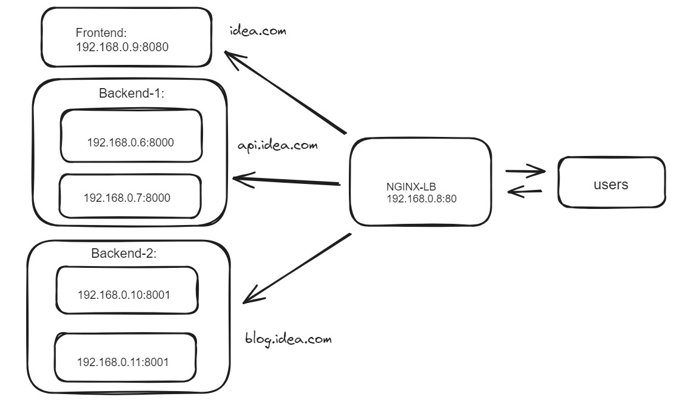

# NGINX Layer-7 HTTP Host-based Load Balancer:
NGINX Layer-7 (HTTP) load balancer distributes incoming web traffic based on various characteristics of the HTTP request, such as the URL, headers, cookies, etc.

This example shows a basic configuration where NGINX listens on port 80 for core domain "idea.com" and proxies requests to a group of backend servers defined in the backend upstream.





In above picture, setting up a host-based load balancer in NGINX involves directing incoming requests to different backend servers based on the host (domain) specified in the HTTP request. Here's an example configuration to achieve this:


### Install Nginx:

```
### Ubuntu/Debian:

sudo apt update
sudo apt install nginx
```


```
### CentOS/RHEL:

sudo yum install epel-release
sudo yum install nginx
```

### Configuration:
Create a Load Balancer Configuration File locate the "/etc/nginx/nginx.conf"

It looks like you're configuring Nginx for host-based load balancing between different backend servers for different domains (idea.com, api.idea.com, and blog.idea.com). This setup defines three  upstream groups (frontend, backend1, and backend2) for these different hosts.


### Test Configuration and Reload Nginx:
```
### Check configuration file and restart the service:

nginx -t
systemctl restart nginx

```

This setup will route traffic based on the specified host (domain) in the HTTP request to different backend servers. You can expand this configuration by adding more server blocks for additional hosts and defining their respective upstream servers.


## Building and Running the NGINX Load Balancer Docker Image:
This Dockerfile assumes you have an nginx.conf file with your desired Nginx configuration for host-based load balancing, and you want to use it within the container.

Run the following commands in the directory where your Dockerfile and nginx.conf are located:

```
docker build -t nginx_lb .
docker run --name nginx_lb_01 -dit -p 80:80 nginx_lb
```

This command starts a container from the "nginx_lb" image, exposing port 80 on the host machine to access the Nginx server running inside the container.


__Ensure the DNS records or hosts file (if testing locally) are set up to resolve "idea.com", "api.idea.com" and "blog.idea.com" to the IP where your NGINX load balancer is running__.

You can access it by navigating to your browser to that URL: 

http://idea.com

http://api.idea.com

http://blog.idea.com

This configuration serves as a basic example. You can further enhance it with SSL termination, health checks, caching, or other NGINX features as required by your application architecture.

